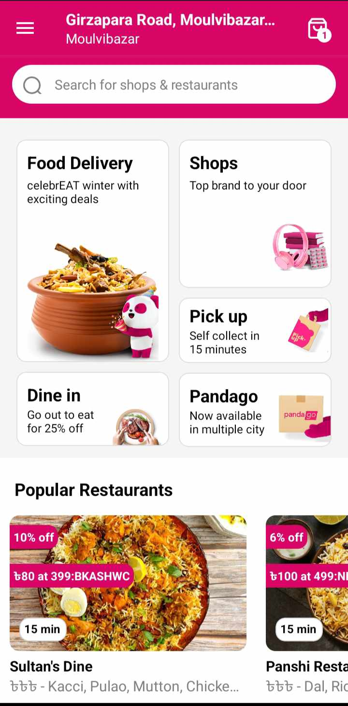

# 🍔 FoodPanda Clone 🍕

## Description

📱 This is a clone of the FoodPanda app, emphasizing the home page and location set page. It allows users to explore and order food seamlessly.

## Technology Used

- Built with React Native Expo 🚀, making it easy to develop for both iOS and Android platforms.

## Getting Started

1. **Clone the Repository:**
   ```bash
   git clone https://github.com/SuhravHussen/foodpanda-clone.git
   cd foodpanda-clone
   ```

## APP SCREEN SHOTS


---


---


---



---


---


